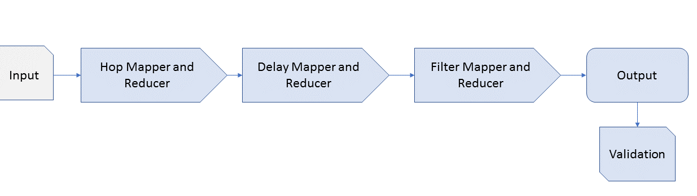

### Problem Statement:
Given historical airplane on time performance data,offer suggestions for two-hop flights that minimize the chance of missing a connection.

### Implementation high level view



### Implementation

The implementation can be divided into following parts

1.	The first map reduce job fetches all the possible combination of two hop flights based on the input provided. 
+	The mapper fetches all the flights which have the origin equal to origin in the input but destination not equal to that in input (to filter out direct flights). Similarly, it fetches all the flights which have destination equal to destination in the input but origin not equal to origin in input(to filter out direct flights). This way mapper gets all the two hop flights possible between the origin and destination mentioned in the input.

+ The output of the mapper is one of either
Key - Airport - Value -{'Firsthop', Flightdetails} or Key - Airport - Value - {'Secondhop',Flightdetails}
+	The reducer then combines all the two hop flights possible between the given origin  and destination in input and emits out Key - {Year,Month,Day,ORIG,DEST} - Value - {Firsthop Flight details, Secondhop Flight details}
Note: In this step we calculate these output pairs based on the Scheduled Arrival and Departure times. 

2.  In this step we run another map reduce phase to compute the mean delay of arrival time for each airline by origin and destination over all the years prior to the year in the input and simultaneously the fraction of flights that were canclled.
+ The output of this map reduce phase is Key - {Month,Airline,Destination,Origin} - Value - {Mean Arrival Delay ,Fraction of flights cancelled} 

3. This phase involves filtering out the Flight hop pairs of record based on the mean delay and cancellation data we observed in previous step.We are mainly interested in if after adding the mean delay observed over the years to the arrival time causes the  flight to miss the second flight or if the flight is historically cancelled more that 20% of the time .(This 20% needs to be fine tunded ) 
+ In the map phase we have two mappers reading from two different sources emitting a common key 
Mapper 1 - Key - {Month,Airline,Origin,Destination} Value - {"Firsthop", Full line as read from the hops reducers output}
Mapper 2 - Key - {Month,Airline,Origin,Destination}  Value - {"DelayAndCancellation",MeanDelay,CancellationFraction}

4. We run the above filter phase again ,but this time we look at only the second hop flights and look to eliminate the flight hop pair if the second flight is delayed by more than 20% historically.We also compute the number of records which are correct and incorrect using global counters in map reduce. By correct we mean those records which are present in our output where both flights actually landed on time and was not cancelled on that day.And by incorrect we mean the the output record contains either a first flight which arrived late or was cancelled or a second flight which was cancelled. 

+ Note: If anyone is wondering steps 3 and 4 take only about 30 seconds each.

5. The final phase is the validation phase where we compute the different flight connections for the inputs based on the actual time the flights arrive and depart at the hop destination on that day . And we compute the number of records we output as this gives a number which indicates the total number of correct connections. Note that we reuse the code from first step

### Task Distribution
Design: Aditya, Apoorv, Dhvani  
HopMapper and Reducer: Aditya and Apoorv  
DelayCancelmapper and Reducer: Aditya and Dhvani  
FilterMapper: Aditya, Apoorv, Dhvani  
Report: Aditya, Apoorv, Dhvani  


### Configuration of the machines used

The program was intially run on AWS EMR with one namenode and four datanodes on the whole dataset. 
Later on we increased the number of datanodes to 8 to get a better runtime.

Below is the configuration of the machines used:  
Namenode:   
vCPU: 8   RAM: 16GB   Hard Disk: 70GB  
Datanodes:   
vCPU: 8  RAM:  16GB   Hard Disk: 70GB  

Processors for all the above machines were 64 bit 2.4 GHz Intel Xeon® E5-2676 v3 (Haswell) processors. 
Each vCPU is a hyperthread of an Intel Xeon core.

### Performance  

Following is the perfromance we got on AWS EMR configurations mentioned above.

|Name Nodes | Data Nodes | Runtime|
|-----------|------------|--------|
|1          | 4          | 29 minutes|
|1          | 8          | 16 minutes|


### Results

####Expreiment 1

Following was the input we gave to our model:

```
2001,7,4,JFK,LAX
2001,7,4,BOS,LAX
2001,12,5,DEN,ORD
```

We found out that the total number of two hop flights which were on time was ** 3561 **.
We found out this using actual arrival time, actual departure time and cancelled data while calculating the two hops.

After the first step where we get the two hop flights, by considering only the CRS scheduled time and not the  cancellation time following was the result :-

| Correct Hops 	| Incorrect Hops 	| Total correct Hops |
|-------------	|-------------	  |--------------------|
| 3410         	| 193        	    | 3561               |  

_correct hops : the two hop connection, where both the flights were on time_  
_incorrect hops : the two hop connection, where either of the flights were not on time or cancelled_

```{r echo = FALSE}
df <- data.frame(Two_Hops= factor(c("Correct Hops", "Incorrect Hops")))
Number_of_Hops=c(3410, 193)

library(ggplot2)
plot <- ggplot(data=df, aes(x=Two_Hops, y=Number_of_Hops, fill=Two_Hops)) +
  geom_bar(stat="identity") +
  scale_fill_manual(values=c("#66CC88", "#CC6886"))
print(plot +ggtitle("Hop accuracy hop map reducer"))
```

After the second step when we give the above data to our model for prediction and consider delay and cancellation for prediction, following was the result

| Correct Predicted Hops 	| Incorrect Predicted Hops 	| Total correct Hops |
|-------------	|-------------	  |--------------------|
| 3263         	| 134        	    | 3561               |  

_correct hops : the two hop connection, where both the flights were on time_  
_incorrect hops : the two hop connection, where either of the flights were not on time or cancelled_

```{r echo = FALSE}
df <- data.frame(Two_Hops= factor(c("Correct Hops", "Incorrect Hops")))
Number_of_Hops=c(3263, 134)

library(ggplot2)
plot <- ggplot(data=df, aes(x=Two_Hops, y=Number_of_Hops, fill=Two_Hops)) +
  geom_bar(stat="identity") +
  scale_fill_manual(values=c("#66CC88", "#CC6886"))
print(plot +ggtitle("Hop accuracy after prediction using model"))
```

Precision and accuracy:  

Follwing is the precision and accuracy for our model:-

|Precision|Accuracy|
|-------- |--------|
| 0.96 | 0.91 |

Precision is calculated as ( Number of True Positives ) / (Number of True Positives + Number of False Positives)

Accuracy is calculated as (correct hops fetched/ total correct hops)

**Conclusion**
Our final output consisted of 3397 two hop flight suggestions. Out of these records 3263 records were correct predictions (the two hop flight reaches destination on time) and 134 were incorrect predictions (the two hop flight does not reach destination in time).  
We validated our result by comparing it to the actual arrival time, departure time and cancellation time of the flights we have generated as output.  
Overall the accuracy of using the average delay and cancellation probability as model is 91% with a precision of 96%.

####Expreiment 2

Following was the input we gave to our model:

```
2014,7,4,JFK,LAX
2014,7,4,BOS,LAX
2014,12,5,DEN,ORD
2014,3,4,ATL,SLC
2014,6,7,TUS,SIT
```

We found out that the total number of two hop flights which were on time was ** 3746 **.
We found out this using actual arrival time, actual departure time and cancelled data while calculating the two hops.

After the first step where we get the two hop flights, by considering only the CRS scheduled time and not the  cancellation time following was the result :-

| Correct Hops 	| Incorrect Hops 	| Total correct Hops |
|-------------	|-------------	  |--------------------|
| 3463         	| 194        	    | 3746               |  

_correct hops : the two hop connection, where both the flights were on time_  
_incorrect hops : the two hop connection, where either of the flights were not on time or cancelled_

```{r echo = FALSE}
df <- data.frame(Two_Hops= factor(c("Correct Hops", "Incorrect Hops")))
Number_of_Hops=c(3463, 194)

library(ggplot2)
plot <- ggplot(data=df, aes(x=Two_Hops, y=Number_of_Hops, fill=Two_Hops)) +
  geom_bar(stat="identity") +
  scale_fill_manual(values=c("#66CC88", "#CC6886"))
print(plot +ggtitle("Hop accuracy hop map reducer"))
```

After the second step when we give the above data to our model for prediction and consider delay and cancellation for prediction, following was the result

| Correct Predicted Hops 	| Incorrect Predicted Hops 	| Total correct Hops |
|-------------	|-------------	  |--------------------|
| 3314         	| 141        	    | 3746               |  

_correct hops : the two hop connection, where both the flights were on time_  
_incorrect hops : the two hop connection, where either of the flights were not on time or cancelled_

```{r echo = FALSE}
df <- data.frame(Two_Hops= factor(c("Correct Hops", "Incorrect Hops")))
Number_of_Hops=c(3314, 141)

library(ggplot2)
plot <- ggplot(data=df, aes(x=Two_Hops, y=Number_of_Hops, fill=Two_Hops)) +
  geom_bar(stat="identity") +
  scale_fill_manual(values=c("#66CC88", "#CC6886"))
print(plot +ggtitle("Hop accuracy after prediction using model"))
```

Precision and accuracy:  

Follwing is the precision and accuracy for our model:-

|Precision|Accuracy|
|-------- |--------|
| 0.95 | 0.88 |

**Conclusion**
Our final output consisted of 3455 two hop flight suggestions. Out of these records 3314 records were correct predictions (the two hop flight reaches destination on time) and 141 were incorrect predictions (the two hop flight does not reach destination in time).  
We validated our result by comparing it to the actual arrival time, departure time and cancellation time of the flights we have generated as output.  
Overall the accuracy of using the average delay and cancellation probability as model is 88% with a precision of 95%.

####Expreiment 3

Following was the input we gave to our model:

```
2009,7,4,JFK,LAX
2009,7,4,BOS,LAX
2009,12,5,DEN,ORD
2009,3,4,ATL,SLC
2009,6,7,TUS,SIT
```

We found out that the total number of two hop flights which were on time was ** 3618 **.
We found out this using actual arrival time, actual departure time and cancelled data while calculating the two hops.

After the first step where we get the two hop flights, by considering only the CRS scheduled time and not the  cancellation time following was the result :-

| Correct Hops 	| Incorrect Hops 	| Total correct Hops |
|-------------	|-------------	  |--------------------|
| 3354         	| 179        	    | 3618               |  

_correct hops : the two hop connection, where both the flights were on time_  
_incorrect hops : the two hop connection, where either of the flights were not on time or cancelled_

```{r echo = FALSE}
df <- data.frame(Two_Hops= factor(c("Correct Hops", "Incorrect Hops")))
Number_of_Hops=c(3354, 179)

library(ggplot2)
plot <- ggplot(data=df, aes(x=Two_Hops, y=Number_of_Hops, fill=Two_Hops)) +
  geom_bar(stat="identity") +
  scale_fill_manual(values=c("#66CC88", "#CC6886"))
print(plot +ggtitle("Hop accuracy hop map reducer"))
```

After the second step when we give the above data to our model for prediction and consider delay and cancellation for prediction, following was the result

| Correct Predicted Hops 	| Incorrect Predicted Hops 	| Total correct Hops |
|-------------	|-------------	  |--------------------|
| 3228         	| 97        	    | 3618               |  

_correct hops : the two hop connection, where both the flights were on time_  
_incorrect hops : the two hop connection, where either of the flights were not on time or cancelled_

```{r echo = FALSE}
df <- data.frame(Two_Hops= factor(c("Correct Hops", "Incorrect Hops")))
Number_of_Hops=c(3228, 97)

library(ggplot2)
plot <- ggplot(data=df, aes(x=Two_Hops, y=Number_of_Hops, fill=Two_Hops)) +
  geom_bar(stat="identity") +
  scale_fill_manual(values=c("#66CC88", "#CC6886"))
print(plot +ggtitle("Hop accuracy after prediction using model"))
```

Precision and accuracy:  

Follwing is the precision and accuracy for our model:-

|Precision|Accuracy|
|-------- |--------|
| 0.97 | 0.89 |

Precision is calculated as ( Number of True Positives ) / (Number of True Positives + Number of False Positives)

Accuracy is calculated as (correct hops fetched/ total correct hops)

**Conclusion**
Our final output consisted of 3325 two hop flight suggestions. Out of these records 3228 records were correct predictions (the two hop flight reaches destination on time) and 97 were incorrect predictions (the two hop flight does not reach destination in time).  
We validated our result by comparing it to the actual arrival time, departure time and cancellation time of the flights we have generated as output.  
Overall the accuracy of using the average delay and cancellation probability as model is 89% with a precision of 97%.  


  

